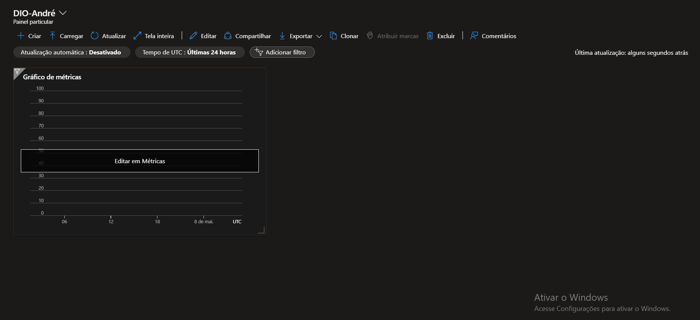

# azure
# Projeto de Monitoramento no Azure

## Objetivo
Criar um dashboard básico no Azure para acompanhamento de recursos e custos utilizando uma conta gratuita de estudante.

## Recursos Utilizados
- **Grupo de Recursos**
- **Azure Data Factory**
- **Azure Monitor**

## Dashboard

## Passo a Passo
1. Criar um Grupo de Recursos:
   - Navegar até "Grupos de Recursos" no Portal Azure
   - Clicar em "Adicionar"
   - Definir nome e região

2. Configurar Azure Data Factory:
   - Buscar por "Data Factory" no Marketplace
   - Selecionar o Grupo de Recursos criado
   - Definir nome e versão

3. Criar Dashboard:
   - Acessar "Monitor" no menu lateral
   - Selecionar "Dashboards"
   - Clicar em "Novo dashboard"
   - Adicionar widgets de:
     - Uso de recursos
     - Custos
     - Status de serviços

## Aprendizados
- Organização de recursos na nuvem
- Criação de dashboards básicos
- Monitoramento de custos

## Links Úteis
- [Documentação do Azure](https://docs.microsoft.com/pt-br/azure/)
- [Tutoriais para Iniciantes](https://learn.microsoft.com/pt-br/azure/azure-portal/)
